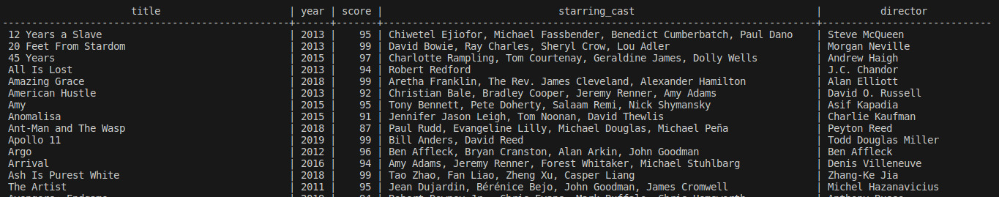

# Rotten Tomatoes Editorial ETL
This ETL (Extract, Transform, Load) project scrapes the top 200 movies from the 2010s according to the Rotten Tomatoes editorial [website](https://editorial.rottentomatoes.com/guide/the-200-best-movies-of-the-2010s/). The extracted data is then transformed and loaded into both a CSV file and a PostgreSQL database.

## Sample Output

 
## Setup
**Pre-requisites**: Docker
+ Clone the project and `cd Rotten-Tomatoes-Editorial-ETL`
+ Build and run
    + `docker compose build`
    + `docker compose run`
### Accessing the database
1. To access the PostgreSQL server, open a terminal and run:
    - `docker-compose exec postgres psql -U postgres` 
2. Once connected, you can interact with the database. For example, to see the table of top 200 movies:
    - `TABLE bestmovies200;`
 